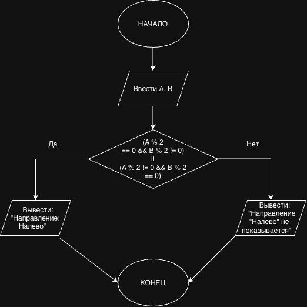

# Домашнее задание №4

## Условие задачи

**Вариант 9. Выбор маршрута**

На развилке дорог стоит знак. Он показывает направление "Налево", если только одно из двух чисел (A или B), полученных от датчиков traffic flow, является четным. Запишите условие для показа направления "Налево".

## 1. Алгоритм и блок-схема

### Алгоритм

1. **Начало**
2. Ввести два целых числа `A` и `B`.
3. Проверить условие:
   - `(A % 2 == 0 && B % 2 != 0) || (A % 2 != 0 && B % 2 == 0)`
4. Если условие истинно, вывести:
   - `Направление: Налево`
5. Иначе вывести:
   - `Направление "Налево" не показывается`
6. **Конец**

### Блок-схема



## 2. Реализация программы

```c
#include <stdio.h>

int main()
{
    int A, B;
    int condition;

    printf("Введите два целых числа A и B: ");
    scanf("%d %d", &A, &B);

    condition = (A % 2 == 0 && B % 2 != 0) ||
                (A % 2 != 0 && B % 2 == 0);

    printf("Условие выполнено (1 - да, 0 - нет): %d\n", condition);

    return 0;
}
```

## 3. Результаты работы программы

### Пример 1

```text
Введите два целых числа A и B: 4 7
Направление: Налево
```

### Пример 2

```text
Введите два целых числа A и B: 4 8
Направление "Налево" не показывается
```

## 4. Информация о разработчике

Каверин Максим, группа БИЦТ-262
